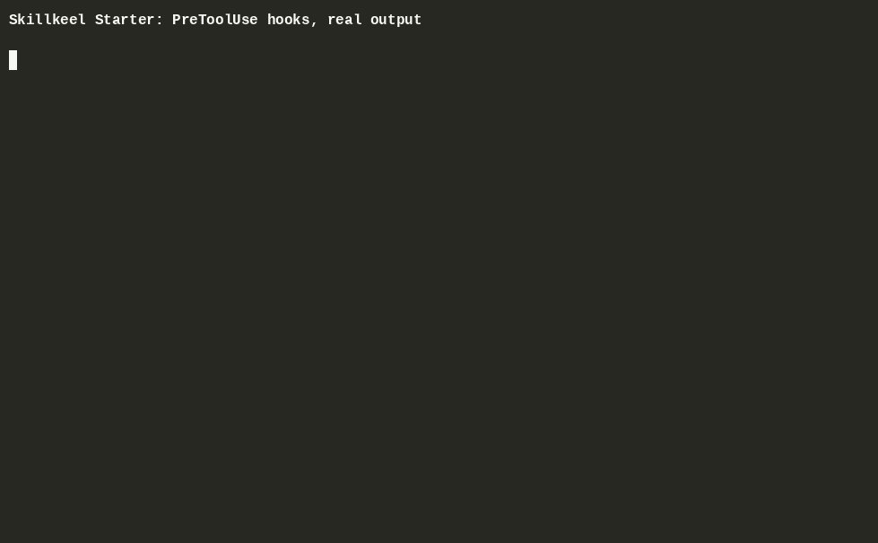

# Skillkeel Starter

Guard hooks and repo skills for [Claude Code](https://claude.com/claude-code). Free, MIT.

[](https://www.claudepluginhub.com/plugins/skillkeel-skillkeel-starter?ref=badge)

Claude Code is fast. It will also run `rm -rf` in the wrong directory, force-push over a teammate's branch, or write an API key straight into `config.py` if nothing stops it. This plugin stops it, and adds eight small skills for the boring parts of repo work.

## Hooks



Every call in the recording is the real hook fed the JSON Claude Code sends. Still image: [docs/guard-bash.png](docs/guard-bash.png).


| Hook | What it does |
|---|---|
| `guard-bash` | Blocks destructive shell commands before they run: `rm -rf /`, `git push --force` without `--force-with-lease`, `git reset --hard`, `git clean -f`, `DROP DATABASE`, `terraform destroy`, `curl \| bash`, `dd` and `mkfs`, and since 0.1.4 git settings that run commands (`core.fsmonitor`, hooks paths, shell aliases) plus writes into `.git/`. Claude sees the reason and asks you instead. |
| `secret-scan` | Blocks a file write that contains an AWS, OpenAI, Anthropic, GitHub or Slack key, a private key, a JWT, or a hard-coded password. |
| `session-start` | Prints two lines at session start: current git state and the list of skills. |

## Skills

| Skill | What it does |
|---|---|
| `commit-message` | Writes a Conventional Commits message from the staged diff. It reads the diff; it does not guess. |
| `pr-description` | Writes a PR body from the branch diff, with a test plan that uses commands that exist in the repo, and a risk section. |
| `claude-md-init` | Generates a short CLAUDE.md. Every command in it was checked against the repo first. |
| `changelog` | Adds Keep a Changelog entries from git history since the last tag. |
| `readme-refresh` | Checks every command and link in your README against the repo and fixes the ones that are wrong. |
| `dependency-audit` | Runs the audit tool for your ecosystem, sorts fixes into safe and needs-approval, and never uses `--force`. |
| `secret-audit` | Finds credentials in git history, masks them, and gives you a plan that starts with rotating the key. |
| `test-gap-finder` | Lists untested modules ranked by recent churn and proposes specific test cases. |

## How it is tested

The hooks have 64 unit tests in `tests/test-hooks.sh`. Each skill has a folder under `evals/` with a fixture repo, a list of expected results, and the unedited transcript of a real Claude Code run. As of 2026-09-13 all eight pass; secret-audit was rerun on 2026-09-15 after its gitleaks commands changed. You can read the transcripts before you install anything.

[docs/compat.md](docs/compat.md) lists every Claude Code version the evals ran on, with the pass counts, generated from the results in this repo. Since 0.1.3 the eval runner also writes a run record per case (`evals/<skill>/record-<date>.json`: exit code, every tool call, skill invocations, grader verdicts that need no model) and `evals/cluster.py` groups failed cases by their first mechanical mismatch, so a runner or grader fault shows up as one bucket instead of eight transcript reads. The skill texts call four external CLIs (gitleaks, trufflehog, pip-audit, gh); `tests/test-cli-verbs.py` checks every subcommand and flag they name against `tests/cli-verbs.json`, a snapshot read from the latest release of each CLI, so a renamed subcommand fails the test before it fails for you.

External test set: u/Far_Business4773 runs 52 evasion cases against a guard of this shape in [lumis-skills/examples/tamper_cases.py](https://github.com/momonanq/lumis-skills/blob/main/examples/tamper_cases.py) (MIT). Cases 41 to 52 came out of the r/ClaudeCode thread with this project; case 42 (`find -exec rm -rf`) is the one fixed in 0.1.1. That file targets a guard with protected paths, which guard-bash does not have, so it is a reference, not part of this test suite.

This plugin does not overlap with the `superpowers` plugin. That one covers process (planning, TDD, debugging). This one covers guardrails and repo chores.

## Install

```
/plugin marketplace add skillkeel/skillkeel-starter
/plugin install skillkeel-starter@skillkeel
```

Or clone the repo and start Claude Code with `claude --plugin-dir ./skillkeel-starter`.

## Turning a guard off for one session

```
SKILLKEEL_ALLOW_DANGEROUS=1 claude   # guard-bash off
SKILLKEEL_ALLOW_SECRETS=1 claude     # secret-scan off
```

## Run the tests

```
bash tests/test-hooks.sh            # 64 hook cases
python3 tests/test-cli-verbs.py     # skill texts vs the CLI snapshot
python3 tests/test-evals-record.py  # eval record and cluster tools
```

## Paid version

Skillkeel Kit (€49) adds a ten-chapter playbook, 24 more skills in six packs, five more guard hooks, five subagents, three checklists, and CLAUDE.md templates for eight stacks: https://skillkeel.gumroad.com/l/skillkeel-kit
